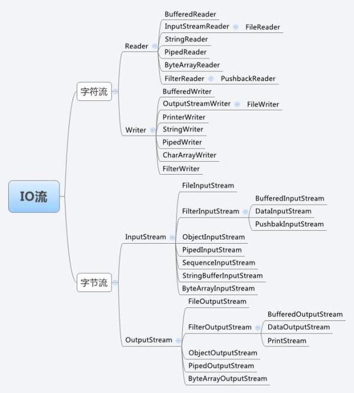

# IO
我们需要一张Java流类图结构,网上找一张对照学习.
## 输入流输出流的分类
* 桉数据流的放心不同可以分为输入流和输出流.
* 按照处理数据单位的不同可以分为字节流和字符流.
* 按照功能不同可以分为节点流和处理流.
* *字节流是最原始的一个流,读出的数据是最底层的二进制,不过他是一个字节一个字节往外读,而不是一位一位往外读(一个字节**byte**是8位**bit**)*.
* *字符流是一个字符一个字符往外读取数据,一个字符是2个字节*.

所有流类,都分别继承自以下四种抽象流类型:
* 字节流,输入流: InputStream
* 字节流,输出流: OutputStream
* 字符流,输入流: Reader
* 字符流,输出流: Writer

## 字节流和处理流
* 节点流就是一根管道直接插到数据源上面，直接读数据源里面的数据，或者是直接往数据源里面写入数据。
* 处理流是包在别的流上面的流，相当于是包到别的管道上面的管道。
* 对于不同的类型(如文件,Array,管道等)以及对于字符流和字节流,有不同的节点流类型.
* 同样的对于不同的处理类型(如Buffering,Filtering等)以及对于字符流和字节流,有不同的处理流类型.

### InputStream(输入流)
继承自InputStream的流都是用于向程序中输入数据,且数据的单位为字节.
#### InputStream的基本方法
主要是read()的各种重载方法,以及close()和skip().

### OutputStream(输出流)
继承自OutputStream的流是用于程序中输入数据,且数据的单位为字节
#### OutputStream的基本方法
主要是write()的各种重载方法,以及close(),flush().

### Reader流
和InputStream一模一样,唯一的区别在于读的数据单位不同(数据的单位为字符)
### Writer流
同上

### 节点流讲解
以File(文件)这个类型作为讲解节点流的典型代表
* FileInputStream和FileOutputStream分别继承自InputStream和OutputStream用于向文件中输入和输出字节.
* FileInputStream和FileOutputStream有多种构造方法.
* FileInputStream和FileOutputStream支持其父类InputStream和OutputStream所提供的数据读写方法.

注意:
* 在实例化FileInputStream和FileOutputStream时要用try-catch语句以处理其可能抛出的FileNotFoundException.
* 在读写数据时也要用try-catch语句以处理可能抛出的IOException.(FileNotFoundException是IOException的子类).

[苍傲孤狼博文提供了一些范例](http://www.cnblogs.com/xdp-gacl/p/3634409.html)
* 使用FileInputStream流来读取FileInputStream.java文件的内容
* 使用FileOutputStream流往一个文件里面写入数据
* 使用FileWriter（字符流）向指定文件中写入数据

### 处理流讲解
#### 缓冲流(Buffering)
缓冲流包含了四个类：BufferedInputStream、BufferedOutputStream、BufferedReader和BufferedWriter.

缓冲流要"套接"在相应的节点流上,对读写的数据提供了缓冲的功能,提高了读写的效率,同时增加了一些新的方法.

#### 转换流
* InputStreamReader和OutputStreamWriter用于字节数据到字符数据之间的转换.
* InputStreamReader需要与InputStream套接.
* OutputStreamWriter需要与OutputStream套接.
* 转换流在构造时可以指定其编码集合.

转换流有两种，一种叫InputStreamReader，另一种叫OutputStreamWriter。InputStream是字节流，Reader是字符流，InputStreamReader就是把InputStream转换成Reader。OutputStream是字节流，Writer是字符流，OutputStreamWriter就是把OutputStream转换成Writer。把OutputStream转换成Writer之后就可以一个字符一个字符地通过管道写入数据了，而且还可以写入字符串。

#### 数据流
* DataInputStream和DataOutputStream分别继承自InputStream和OutputStream,需要分别套接在InputStream和OutputStream类型的节点流上.
* DataInputStream和DataOutputStream提供了可以存取与机器无关的Java原始类型数据(如:int,double等)的方法.

#### 打印流——Print
* PrintWriter和PrintStream都属于输出流,分别针对字符与字节.
* PrintWriter和PrintStream提供了重载的print,PrintIn方法用于多种数据类型的输出.
* PrintWriter和PrintStream的输出操作不会抛出异常,用户通过检测错误状态获取错误信息.
* PrintWriter和PrintStream有自动flush功能.

#### 对象流——Object
直接将Object写入或读出

在这个流里面需要掌握关键字**transient**,某一个属性是透明的,序列化的时候就不考虑这个属性,还有**Serializable**接口,这是一个标志性接口,通过这个接口标记的类的对象可以被序列化,并且是由JDK帮控制这个类的对象怎么序列化.还有一个接口是externalizable,通过这个接口标记的类就可以自己控制对象的序列化.