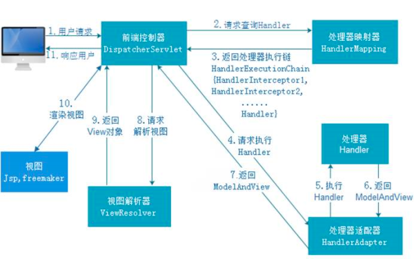

# Spring框架问题

## ioc里面的循环依赖是如何解决的

重点在于“早期引用”，提前暴露对象，来解决

DefaultSingletonBeanRegistry类里有一组缓存：
* singletonObjects : 用于存放完全初始化好的 bean，从该缓存中取出的 bean 可以直接使用
* earlySingletonObjects : 存放原始的 bean 对象（尚未填充属性），用于解决循环依赖
* singletonFactories : 存放 bean 工厂对象，用于解决循环依赖

[Spring IOC 容器源码分析 - 循环依赖的解决办法](https://cloud.tencent.com/developer/article/1145275)

## spring MVC的工作流程是怎样的

主要在于 DispatcherServlet 类， 其中的initStrategies方法，实现了Spring MVC的初始化工作。

1、前端控制器DispatcherServlet（不需要程序员开发）
作用接收请求，响应结果，相当于转发器，中央处理器。
有了DispatcherServlet减少了其它组件之间的耦合度。

2、处理器映射器HandlerMapping(不需要程序员开发)
作用：根据请求的url查找Handler

3、处理器适配器HandlerAdapter
作用：按照特定规则（HandlerAdapter要求的规则）去执行Handler
4、处理器Handler(需要程序员开发, 类似代码中写的Controller)
注意：编写Handler时按照HandlerAdapter的要求去做，这样适配器才可以去正确执行Handler
返回ModelAndView

5、视图解析器View resolver(不需要程序员开发)
作用：进行视图解析，根据逻辑视图名解析成真正的视图（view）
返回View

6、视图View(需要程序员开发, jsp)
View是一个接口，实现类支持不同的View类型（jsp、freemarker、pdf...）
填充模型数据

## 什么是AOP？Spring中为啥要引入AOP或者AOP有什么好处？

AOP简单了说就是在目标方法执行前可以自定义一些操作，在方法执行中或者执行后也可以自定义操作，所以，一般都是基于代理模式来实现，Spring支持3种代理模式，jdk原生的代理和cglib代理,AspectJ静态代理。

AOP可以给程序带良好的扩展性和封装性，可以实现业务代码与非业务代码的隔离。比如：可以在不改变目标代码的前提下，实现目标方法的增强，比如做方法执行时间监控，记录方法访问日志，再比如：数据库的connection.close()默认是把连接关闭掉，但是数据库连接池的场景中，为了不改变用户的使用习惯，一般调用close的时候是把连接重新放回到池中，这是因为从数据库连接池中拿到的连接实际上是原生连接的一个代理类，所以内部把close给重写了。实际上代理模式的优点实际上也是AOP的优点。

## IOC

IoC 不是一种技术，只是一种思想，一个重要的面向对象编程的法则，它能指导我们如何设计出松耦合、更优良的程序。传统应用程序都是由我们在类内部主动创建依赖对象，从而导致类与类之间高耦合，难于测试；有了IoC容器后，把**创建和查找依赖对象的控制权交给了容器**，由容器进行注入组合对象，所以对象与对象之间是 松散耦合，这样也方便测试，利于功能复用，更重要的是使得程序的整个体系结构变得非常灵活。

IoC的一个重点是在系统运行中，动态的向某个对象提供它所需要的其他对象。这一点是通过DI（Dependency Injection，依赖注入）来实现的

### IOC容器的原理

IOC容器其实就是一个大工厂，它用来管理我们所有的对象以及依赖关系。

* 原理就是通过Java的**反射**技术来实现的！通过反射我们可以获取类的所有信息(成员变量、类名等等等)！
* 再通过配置文件(xml)或者注解来**描述**类与类之间的关系
* 我们就可以通过这些配置信息和反射技术来**构建**出对应的对象和依赖关系了！

[Spring IOC知识点一网打尽！](https://segmentfault.com/a/1190000014979704)

我们简单来看看实际Spring IOC容器是怎么实现对象的创建和依赖的：

* 根据Bean配置信息在容器内部创建Bean定义注册表
* 根据注册表加载、实例化bean、建立Bean与Bean之间的依赖关系
* 将这些准备就绪的Bean放到Map缓存池中，等待应用程序调用

Spring容器(Bean工厂)可简单分成两种：

* BeanFactory
    这是最基础、面向Spring的
* ApplicationContext
    这是在BeanFactory基础之上，面向使用Spring框架的开发者。提供了一系列的功能！

ApplicationContext和BeanFactory不同之处在于:

* ApplicationContext会利用Java反射机制自动识别出配置文件中定义的BeanPostProcessor、 InstantiationAwareBeanPostProcesso 和BeanFactoryPostProcessor后置器，并自动将它们注册到应用上下文中。而BeanFactory需要在代码中通过手工调用addBeanPostProcessor()方法进行注册
* ApplicationContext在初始化应用上下文的时候就实例化所有单实例的Bean。而BeanFactory在初始化容器的时候并未实例化Bean，直到第一次访问某个Bean时才实例化目标Bean。

## spring boot 缺点优点？

Spring Boot 的优点快速开发，特别适合构建微服务系统，另外给我们封装了各种经常使用的套件，比如mybatis、hibernate、redis、mongodb等。

* 使用 Spring 项目引导页面可以在几秒构建一个项目
* 方便对外输出各种形式的服务，如 REST API、WebSocket、Web、Streaming、Tasks
* 非常简洁的安全策略集成
* 支持关系数据库和非关系数据库
* 支持运行期内嵌容器，如 Tomcat、Jetty
* 强大的开发包，支持热启动
* 自动管理依赖
* 自带应用监控
* 支持各种 IDE，如 IntelliJ IDEA 、NetBeans

缺点是集成度较高，使用过程中不太容易了解底层。