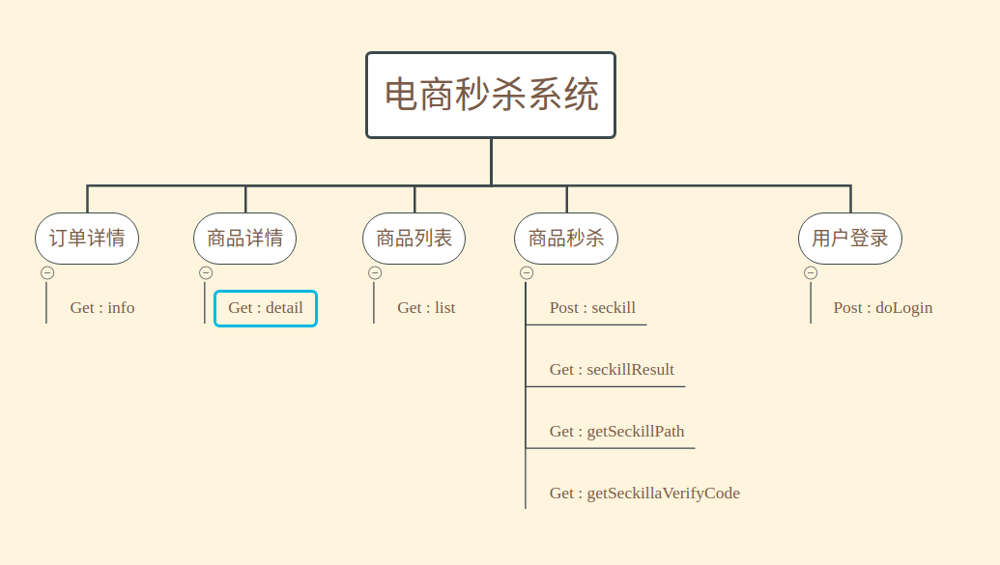

# 电商秒杀系统

前后端个人独立搭建,对秒杀这个功能做了高并发方面的优化.完成前后端分离,前端使用Vue完
成SPA单页面应用.

项目技术: SpringBoot,MyBatis,Druid,Redis,RabbitMQ,Swagger2,Vue
主要包含以下功能:用户登录,商品列表,商品详情,商品秒杀,订单详情.
项目优化: 
* 实现分布式Session.
* 使用Redis进行对象缓存,解决超卖问题,缓解数据库压力.
* 使用RabbitMQ队列缓冲,异步下单.
* 实现秒杀接口隐藏,数学公式验证码,接口限流来防止恶意访问.

秒杀场景下，并发会特别的大，有两种情况会导致库存卖超：（1）一个用户同时发出了多个请求，如果库存足够，没加限制，用户就可以下多个订单。（2）减库存的SQL上没有加库存数量的判断，并发的时候也会导致把库存减成负数。对于（1）前端加验证码，防止合法用户快速点鼠标同时发出多个请求，在后端的miaosha_order表中，对user_id和goods_id加唯一索引，确保就算是刷接口一个用户对一个商品绝对不会生成两个订单。对于（2）需要在扣减库存的SQL上加上库存数量的判断，只有扣减库存成功才可以生成订单

使用Redis缓存的对象有：
 秒杀商品的库存，减少了对数据库的访问。
 秒杀是否结束的标志。
 用户的Cookie，实现了分布式Session。
 验证码的计算结果,key为用户id，商品id。
 接口限流的AccessKey，记录访问次数,超过设置的最大访问次数时，返回json格式的http response。
 储存秒杀地址，key为用户id_商品id。

## 后端部分

### SeckillController 秒杀的关键实现部分

SeckillController 实现 InitializingBean 接口，在该bean初始化后时，即将秒杀商品库存存入Redis

InitializingBean接口为bean提供了属性初始化后的处理方法，它只包括afterPropertiesSet方法，凡是继承该接口的类，在bean的属性初始化后都会执行该方法。

#### seckill 方法

seckill 方法 接受两个参数，一个秒杀地址，一个商品id
https://blog.csdn.net/CSDN_Terence/article/details/77744042
seckill 方法逻辑：
* 首先判断是否有user
* 验证秒杀地址
* 通过Hashmap做一个内存标记,记录商品是否已经秒杀结束(减少Redis的访问)
* Redis 预减库存，当库存小于0时，设置上一条的内存标记为true
* 判断是否重复秒杀，看Redis中是否有记录
* 放入消息队列，并直接返回排队中信息

消息队列传递的为用户和商品的封装

消息发送者通过ConfirmCallback，ReturnCallback，进行消息确认和消息退回

消息接受者首先检查商品库存，再判断是否重复秒杀

然后正式调用秒杀方法，秒杀方法是一个事务，包含减库存和下订单，其中减库存要经过一个库存大于0的判断，所以减库存可能失败，成功则下订单，失败则设置秒杀结束，之后前端轮讯时会得知此消息

秒杀订单表中有一个唯一索引，包含用户id和商品id，保证订单的唯一性。

最后消息接受者进行消息确认，确认消息已经消费成功（注意要在设置里设置自动确认为false）

至此，秒杀的全过程结束

#### seckillResult 方法

逻辑：

* 首先判断是否有user
* 获取秒杀结果，秒杀成功返回订单id，秒杀失败返回-1,排队中返回0

主要是由前端来轮讯调用此方法。

#### getSeckillPath 方法

两个参数，商品id，和验证码结果

首先判断是否有user，再判断验证码是否正确，创建秒杀地址，返回秒杀地址

秒杀地址通过对UUID的工具类生成的32位随机字符串+一个固定盐值做一个md5来创建

#### getSeckillaVerifyCode 方法

一个参数，商品id

首先判断是否有user

SeckillService 中 generateVerifyCode 方法 调用 Random.nextInt(10) 生成数学公式，通过getEngineByName("JavaScript")之后调用eval方法计算数学公式结果，把结果储存在redis中

创建 BufferedImage 类型的图片，通过userid和goodsid来确保验证码对应的user，验证码结果存在redis中

通过ImageIO把图片写入response.getOutputStream()，返回

### 接口限流

#### 自定义注解 AccessLimit

要注意的是自定义注解类型为 public @interface

两个元注解@Retention(RUNTIME), @Target(METHOD)

#### 拦截器 AccessInterceptor

`HandlerMethod hm = (HandlerMethod)handler;`
`AccessLimit accessLimit = hm.getMethodAnnotation(AccessLimit.class);`

通过以上两句拿到注解，

在注解时，设置访问间隔时间和最大访问次数，以及是否需要登录

`String key = request.getRequestURI() + "_" + user.getId();`

这句来拿到我们存入redis时的key，每次访问，对我们的数据自增，超过最大访问次数时，返回一个错误。

我们前端已经做了一个每五秒只能点击一次秒杀按钮的处理，这里的限流是为了防止恶意访问。

### 全局异常处理

自定义全局异常类 GlobalException 继承 RuntimeException

全局异常处理类，GlobalExceptionHandler，对此类注解@ControllerAdvice

对类中方法进行@ExceptionHandler注解，给注解传入我们需要处理的异常类。

---

[Java开发面试：高并发秒杀系统如何设计与优化](https://blog.csdn.net/CSDN_Terence/article/details/77744042)