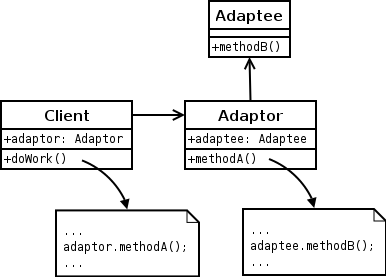

# 适配器模式（Adapter）

## 目的

把一个类的接口变换成客户端所期待的另一种接口，从而使原本接口不匹配而无法一起工作的两个类能够在一起工作。

## 一个现实的例子

假设你的的存储卡中有一些照片，需要将它们传输到计算机上。 为了传输它们，您需要某种与计算机端口兼容的适配器，以便将存储卡连接到计算机。 在这种情况下，读卡器是适配器。

## 程序示例（本例子为对象适配器）

假设有一个只能使用划艇但不能航行的船长。

首先我们创建一个接口 `RowingBoat`

```Java
public interface RowingBoat {
  void row();
}
```

和一个类`FishingBoat`
```Java
public class FishingBoat {
  private static final Logger LOGGER = LoggerFactory.getLogger(FishingBoat.class);
  public void sail() {
    LOGGER.info("The fishing boat is sailing");
  }
}
```

我们的船长类希望通过实现`RowingBoat`接口来进行航行

```Java
public class Captain implements RowingBoat {

  private RowingBoat rowingBoat;

  public Captain(RowingBoat rowingBoat) {
    this.rowingBoat = rowingBoat;
  }

  @Override
  public void row() {
    rowingBoat.row();
  }
}
```

假设海盗来了，我们的船长需要逃离，但只有渔船可用。那么我们需要创建一个适配器，允许船长用他的划艇技能操作渔船。

```Java
public class FishingBoatAdapter implements RowingBoat {

  private static final Logger LOGGER = LoggerFactory.getLogger(FishingBoatAdapter.class);

  private FishingBoat boat;

  public FishingBoatAdapter() {
    boat = new FishingBoat();
  }

  @Override
  public void row() {
    boat.sail();
  }
}
```

通过这个适配器，我们的船长可以使用渔船逃离海盗。

```Java
Captain captain = new Captain(new FishingBoatAdapter());
captain.row();
```

## 什么情况下使用适配器模式？

* 当你想使用现有的类，但其接口与你需要的接口不匹配
* 当你想创建一个可重用的类，它与不相关或不可预见的类（即不一定具有兼容接口的类）合作
* 当你需要使用几个现有的子类，但通过对每个子类进行子类化来调整它们的接口是不切实际的。 通过使用对象适配器可以调整其父类的接口
* 大多数使用第三方库的应用程序使用适配器作为应用程序和第三方库之间的中间层，以将应用程序与库分离。 如果必须使用另一个库，则只需要新库的适配器，而无需更改应用程序代码

## 结论

类的适配器与对象的适配器在实现上有不同的权衡：

### 类的适配器


* 通过继承实际的`Adaptee`类来使`Adaptee`适配`Target`。 因此，当我们想要调整类及其所有子类时，类适配器将不起作用。
* 让`Adapter`重写一些`Adaptee`行为，因为`Adapter`是`Adaptee`的子类。
* 只引入一个对象，并且不需要额外的指针间接指到`Adaptee`。

### 对象适配器



* 让一个`Adapter`与许多`Adaptee`一起工作 - 即`Adaptee`本身及其所有子类（如果有的话）。 适配器还可以立即向所有`Adaptee`添加功能。
* 使得重写`Adaptee`行为变得更加困难。 它将需要子类化`Adaptee`并使`Adapter`引用子类而不是`Adaptee`本身。

## Java中的实际应用

[java.util.Arrays#asList()](https://docs.oracle.com/javase/8/docs/api/java/util/Arrays.html#asList-T...-)

[java.util.Collections#list()](https://docs.oracle.com/javase/8/docs/api/java/util/Collections.html#list-java.util.Enumeration-)

[java.util.Collections#enumeration()](https://docs.oracle.com/javase/8/docs/api/java/util/Collections.html#enumeration-java.util.Collection-)

[javax.xml.bind.annotation.adapters.XMLAdapter](https://docs.oracle.com/javase/8/docs/api/javax/xml/bind/annotation/adapters/XmlAdapter.html#marshal-BoundType-)

---

推荐阅读：

[Adapter pattern](https://en.wikipedia.org/wiki/Adapter_pattern) 维基百科

[java-design-patterns-adapter](https://github.com/iluwatar/java-design-patterns/tree/master/adapter) 本文示例及大部分内容来自于此

[适配器模式（Adapter Pattern）- 最易懂的设计模式解析](https://blog.csdn.net/carson_ho/article/details/54910430) 充分的介绍